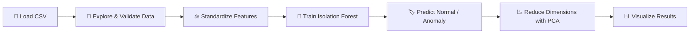

<div align="center">

# 🔍 Anomaly Detection using Isolation Forest

### Unsupervised outlier detection on tabular health data, with an interactive Streamlit demo

[](https://www.python.org/)
[](https://scikit-learn.org/)
[](https://streamlit.io/)
[](https://jupyter.org/)
[](#-license)

</div>

---

## 📖 Overview

This project detects **anomalies in tabular data** using an **Isolation Forest**, an unsupervised tree-based algorithm that isolates outliers instead of profiling normal data points. It was originally built around a **thyroid dataset**, but the pipeline and the accompanying app generalize to any numeric tabular dataset.

The project ships in two parts:

| Component | Description |
|---|---|
| 🧪 **Notebook** (`data_preprocessing_and_model_training.ipynb`) | End-to-end exploration: load data → inspect → standardize → train Isolation Forest → visualize with PCA |
| 🖥️ **Streamlit App** (`app.py`) | A polished, interactive web app to upload your own CSV, tune hyperparameters, and explore results visually — no code required |

> **Why Isolation Forest?** Unlike distance- or density-based methods, Isolation Forest isolates observations by randomly partitioning the feature space. Anomalies are "few and different," so they get isolated in fewer partitions — making the algorithm fast, scalable, and effective in high-dimensional data without needing labeled examples.

---

## 📑 Table of Contents

- [Features](#-features)
- [Project Structure](#-project-structure)
- [Dataset](#-dataset)
- [Installation](#-installation)
- [Usage](#-usage)
  - [Run the Notebook](#run-the-notebook)
  - [Run the Streamlit App](#run-the-streamlit-app)
- [How It Works](#-how-it-works)
- [Model Configuration](#-model-configuration)
- [Results](#-results)
- [Tech Stack](#-tech-stack)
- [Roadmap](#-roadmap)
- [Contributing](#-contributing)
- [License](#-license)
- [Acknowledgments](#-acknowledgments)

---

## ✨ Features

- 📂 **Flexible data input** — works with the original thyroid dataset or any numeric CSV you upload
- ⚖️ **Feature standardization** with `StandardScaler` so every feature contributes fairly to distance/partitioning
- 🌲 **Isolation Forest** model with tunable `n_estimators`, `contamination`, and `random_state`
- 📉 **Dimensionality reduction with PCA** for clean 2D visualization of high-dimensional results
- 📊 **Interactive Plotly visualizations** — anomaly score histograms and PCA scatter plots, right in the browser
- 🖱️ **No-code Streamlit interface** — adjust hyperparameters with sliders and instantly see updated results
- ⬇️ **One-click CSV export** of predictions and anomaly scores
- 🧹 **Automatic handling** of missing values reporting and non-numeric column exclusion

---

## 🗂 Project Structure

```

├── data_preprocessing_and_model_training.ipynb   # Exploratory notebook: EDA + model training
├── app.py                                        # Streamlit web app
├── requirements.txt                              # Python dependencies
├── .gitignore                                    # Files/folders excluded from git
├── thyroid_dataset.csv                           # (not included — see Dataset section)
└── README.md                                     # You are here
```

---

## 📊 Dataset

The notebook expects a CSV file named **`thyroid_dataset.csv`** in the project root, with the following structure:

- A set of **numeric feature columns** describing each observation
- An **`Outlier_label`** column used only for reference/validation (it is **dropped** before training, since Isolation Forest is unsupervised)

```python
X = df.drop("Outlier_label", axis=1)   # Features
y = df["Outlier_label"]                # Reference label (not used in training)
```

> 🔁 **Using your own data?** The Streamlit app accepts *any* CSV — just upload it and select which columns (if any) to exclude from training, such as an existing label column.

---

## ⚙️ Installation

**1. Clone the repository**

```bash
git clone https://github.com/zakir-maswani/Anomalies-Detection-Isolation-Fores>.git
cd <your-repo>
```

**2. Create and activate a virtual environment** *(recommended)*

```bash
python -m venv venv
source venv/bin/activate      # macOS/Linux
venv\Scripts\activate         # Windows
```

**3. Install dependencies**

```bash
pip install -r requirements.txt
```

---

## 🚀 Usage

### Run the Notebook

```bash
jupyter notebook data_preprocessing_and_model_training.ipynb
```

Make sure `thyroid_dataset.csv` is in the same directory before running all cells.

### Run the Streamlit App

```bash
streamlit run app.py
```

Then open the URL shown in your terminal (typically `http://localhost:8501`). From there you can:

1. Upload a CSV (or try the built-in synthetic sample dataset)
2. Choose which columns to exclude from training
3. Tune `n_estimators`, `contamination`, and `random_state` in the sidebar
4. Click **🚀 Run Anomaly Detection**
5. Explore results across the **Data Overview**, **Detection Results**, **Visualization**, and **Export** tabs

---

## 🧠 How It Works



1. **Load** — Read the dataset and perform basic checks (shape, dtypes, summary stats, nulls).
2. **Separate features & target** — Drop the reference label column; it isn't used for training.
3. **Standardize** — Scale all features to zero mean / unit variance with `StandardScaler`, since Isolation Forest's random splits are sensitive to feature scale.
4. **Train** — Fit an `IsolationForest` on the scaled features.
5. **Predict** — Each observation is labeled `1` (normal) or `-1` (anomaly), and assigned a continuous **anomaly score** (more negative = more anomalous).
6. **Visualize** — Project the scaled features down to 2 dimensions with **PCA** purely for plotting; this has no effect on the trained model.

---

## 🔧 Model Configuration

| Parameter | Default | Description |
|---|---|---|
| `n_estimators` | `200` | Number of isolation trees in the ensemble. More trees → more stable scores, slower training. |
| `contamination` | `0.036` | Expected proportion of outliers in the data. Directly controls the decision threshold. |
| `random_state` | `42` | Seed for reproducible results. |

All three are exposed as interactive controls in the Streamlit sidebar.

---

## 📈 Results

For the thyroid dataset with the default configuration, the model separates observations into two classes:

| Prediction | Label | Meaning |
|---|---|---|
| `1` | Normal | Observation behaves like the majority of the data |
| `-1` | Outlier | Observation is structurally different — isolated in fewer partitions |

The PCA scatter plot (available in both the notebook and the app) visually separates these two groups along the two principal components, making it easy to spot clusters of anomalies at a glance.

---

## 🛠 Tech Stack

| Category | Tools |
|---|---|
| Language | Python 3.9+ |
| Data Handling | pandas, numpy |
| Modeling | scikit-learn (`IsolationForest`, `StandardScaler`, `PCA`) |
| Visualization (Notebook) | matplotlib, seaborn |
| Visualization (App) | Plotly |
| Web App | Streamlit |
| Environment | Jupyter Notebook |

---

## 🗺 Roadmap

- [ ] Add support for batch comparison of multiple contamination values
- [ ] Add alternative anomaly detection algorithms (Local Outlier Factor, One-Class SVM) for comparison
- [ ] Add automated feature scaling diagnostics and correlation heatmap
- [ ] Persist trained models with `joblib` for reuse without retraining
- [ ] Dockerize the Streamlit app for one-command deployment

---

## 🤝 Contributing

Contributions are welcome! To contribute:

1. Fork the repository
2. Create a feature branch (`git checkout -b feature/your-feature`)
3. Commit your changes (`git commit -m "Add your feature"`)
4. Push to your branch (`git push origin feature/your-feature`)
5. Open a Pull Request

Please open an issue first to discuss significant changes.

---

## 📄 License

This project is licensed under the **MIT License** — see the [LICENSE](LICENSE) file for details.

---

## 🙏 Acknowledgments

- [scikit-learn](https://scikit-learn.org/) for the `IsolationForest` implementation
- [Streamlit](https://streamlit.io/) for making interactive ML apps effortless to build
- The original Isolation Forest paper: *Liu, F.T., Ting, K.M., Zhou, Z.H. (2008). "Isolation Forest." ICDM.*

